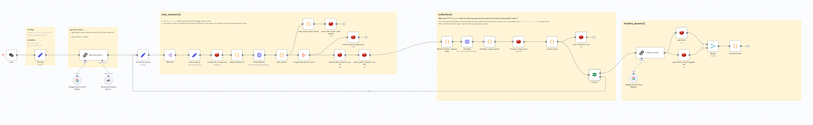
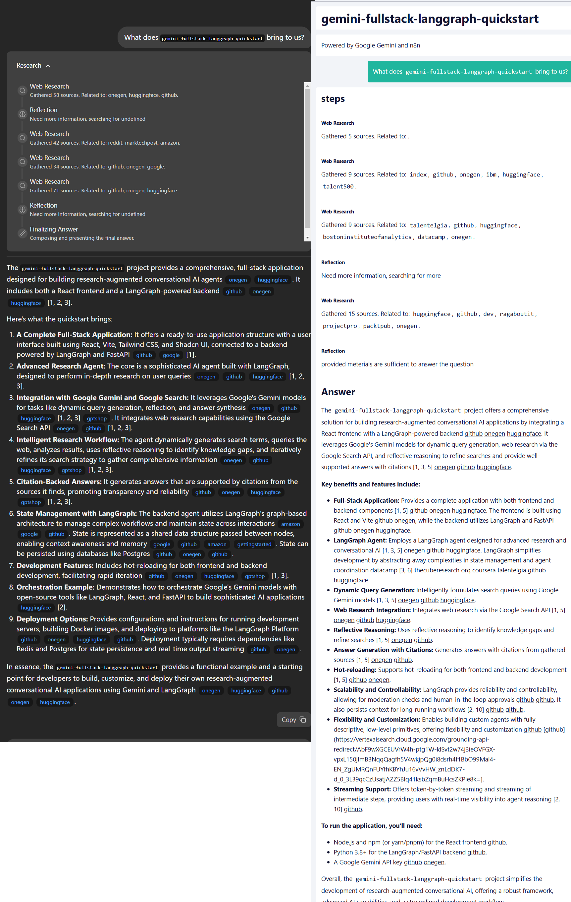

# gemini-fullstack-langgraph-quickstart-n8n
Replicate `gemini-fullstack-langgraph-quickstart` in lowcode platform **N8N**, nearly 1:1

## Getting Started

### 1. Additional prerequisites 

- a redis service

> Use external redis to maintain some global variables for whole process (It is difficult to achieve global state in n8n).

### 2. Import workflow to your n8n instance
1. download **workflow.json** file
2. create a new workflow and open it.
3. click "..." (top right corner) -> import from file -> choose the file

> My version is `1.95.3`, you may encounter nodes unrecognition problems in import if your version is incompatible with this. Maybe you can ask ai about this.

## Screenshot 

### comparison

