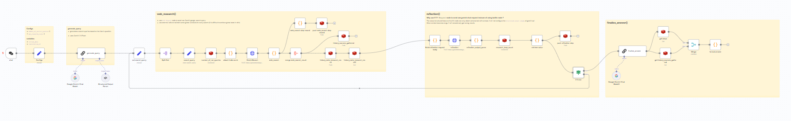

# gemini-fullstack-langgraph-quickstart-n8n

[English](README.md) | 简体中文

使用低代码平台 **N8N** 1:1(几乎) 重构 `gemini-fullstack-langgraph-quickstart` 项目

## 开始使用

### 1. 额外要求

- 一个可以连接的 redis 服务

> 需要使用外部redis原因是: n8n中的基本节点完全没有提供全局变量的功能, 像这个项目中存在环状节点的循环流程, 虽然把变量完全放在上下文中也能实现, 但是异常复杂, 使用全局变量能简化很多

### 2. 导入workflow
1. 下载 **workflow.json** 文件
2. 在你的n8n中新建一个 workflow 并打开.
3. 右上角 "..." 按钮 -> import from file -> 导入文件

> 我创建这个工作流的版本是 `1.95.3`, 试了下低版本导入时会遇到一些节点无法识别的问题, 如果遇到这个问题了你可以试试更新或者咨询AI.

## 截图

### 效果对比

